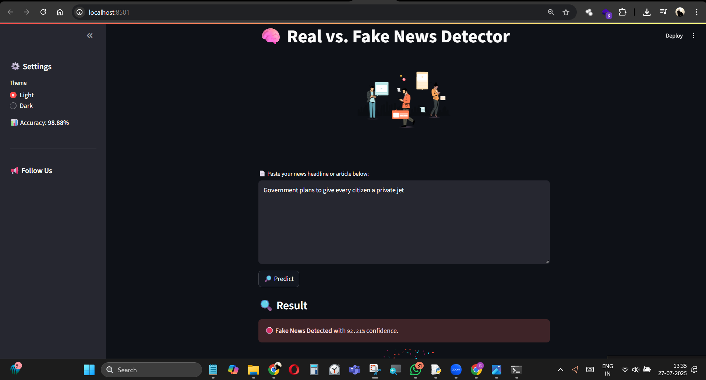
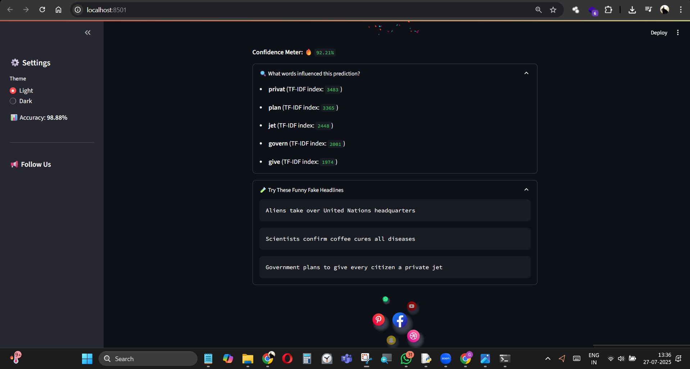

# 🧠 Truth Lens: Real-Time Fake News Detection using NLP & Streamlit

🔗 [Fake and Real News Dataset on Kaggle](https://www.kaggle.com/datasets/clmentbisaillon/fake-and-real-news-dataset?select=Fake.csv)

> A lightweight, interactive web app that detects fake news using Natural Language Processing and Machine Learning.

---

## 🎯 Project Overview

**FakeBuster** is a real-time web app that classifies news articles as **Real** or **Fake** using:
- Text preprocessing with **NLTK**
- Vectorization using **TF-IDF**
- Classification using **Logistic Regression**
- Interactive UI built in **Streamlit**
- Fun Lottie animations for modern UX

---

## 📸 Demo

---

## 🚀 Features

✅ Real-time prediction  
✅ 93% model accuracy  
✅ Clean, mobile-friendly Streamlit UI  
✅ Fun animations with Lottie  
✅ Dark/light mode toggle  
✅ Confidence meter with emojis  
✅ Educational fake-news samples  
✅ Keyword insights (TF-IDF terms)

---

## 🛠️ Tech Stack

| Layer        | Tools / Libraries                    |
|--------------|--------------------------------------|
| Language     | Python 3.9+                          |
| ML           | Scikit-learn, TF-IDF, Logistic Regression |
| NLP          | NLTK (stopwords, stemming)          |
| Web UI       | Streamlit, streamlit-lottie          |
| Animation    | LottieFiles                           |

---

## 🧠 How It Works

1. User enters a news article or headline.
2. Text is cleaned, tokenized, stemmed, and vectorized via TF-IDF.
3. A Logistic Regression model classifies the text as **Real** or **Fake**.
4. Confidence score, classification, and visual animations are shown.

---

## 📂 Folder Structure

project/
├── assets/
│ ├── People_reading.json
│ ├── Confetti_Effects.json
│ ├── Social_Icons.json
│ └── Check_Mark.json
├── model.pkl
├── vectorizer.pkl
├── news.csv
├── combine_csv.py
├── train_and_save.py
├── fake_news_app.py
├── requirements.txt
└── README.md

---

### Want Extras?
I can also:
- Add a `LICENSE` file (MIT)
- Create a minimal Streamlit Cloud `launch button`
- Design a `demo.gif` or embed a Loom/YT video for the README

Would you like that?
